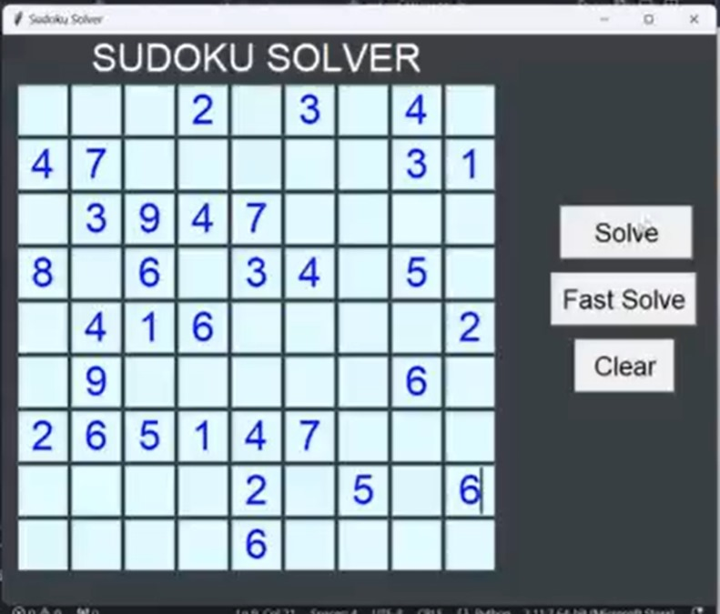

# 🧩 Sudoku Solver 🧩

## 📜 Overview
This is a **Sudoku Solver** built using **Python** and **Tkinter**. It uses a **Backtracking Algorithm** to solve Sudoku puzzles step by step, with real-time updates on the puzzle board. The application provides a graphical user interface (GUI) for entering the puzzle, and the solver automatically fills in the solution.

🔑 **Key Features:**
- **Sudoku Solving Algorithm**: Solves puzzles using Backtracking.
- **GUI**: Simple and interactive interface built with Tkinter.
- **Real-time Updates**: Visualizes the solving process step by step.
- **Validation**: Checks if the Sudoku puzzle is valid before solving.

## ⚙️ How It Works

1. **User Input**: Enter the Sudoku puzzle in a 9x9 grid.
2. **Validation**: The system checks for any invalid entries in the puzzle.
3. **Solve**: Once validated, the solver uses a backtracking algorithm to solve the puzzle.
4. **Real-Time Updates**: The solution is filled step-by-step, with the board updating in real time to show progress.

## 🖥️ Features

- **Interactive GUI**: Input puzzle values, navigate with arrow keys, and solve in steps.
- **Customization**: Speed of solving can be adjusted for better visualization.
- **Error Handling**: Alerts users when an invalid Sudoku puzzle is detected.

## 🎯 Future Scope
- A **Chrome Extension** for solving Sudoku puzzles directly from the browser is being developed! 🚀

## 📸 Screenshots

Here are some screenshots of the Sudoku Solver in action:
 

 

 
 

## 🤝 Acknowledgments

- **Tkinter** for the GUI framework.
- **Backtracking Algorithm** for the Sudoku-solving logic.

Enjoy solving puzzles! 🧩💡
